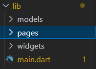
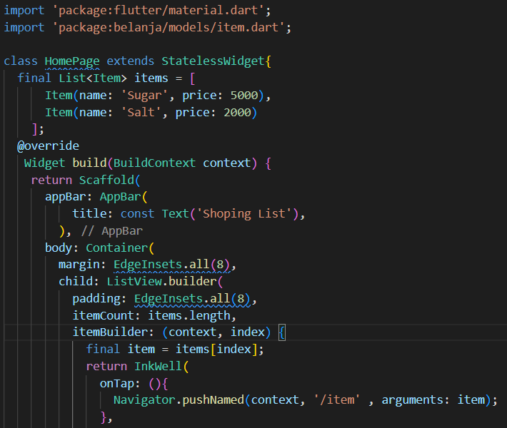
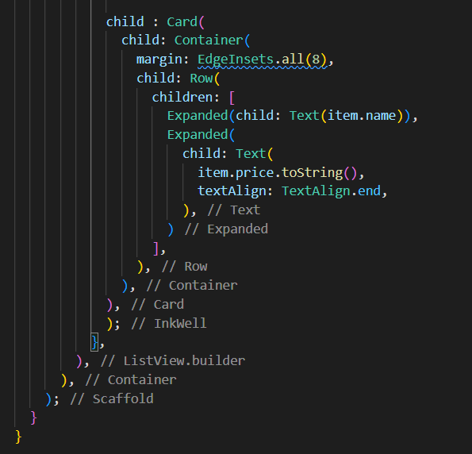
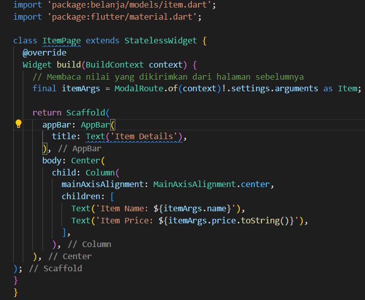
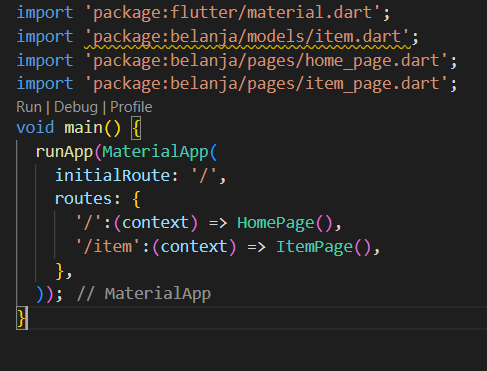
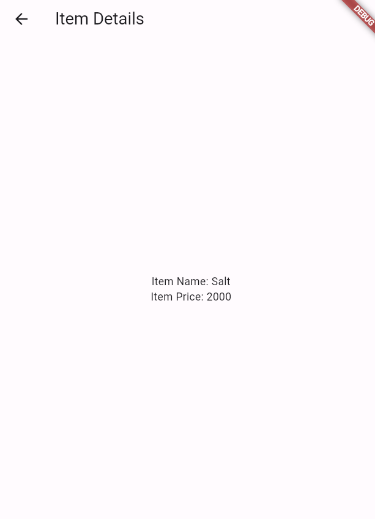
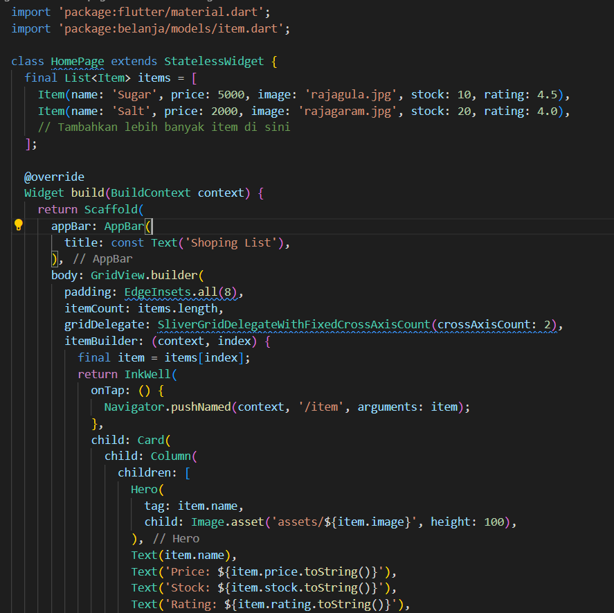
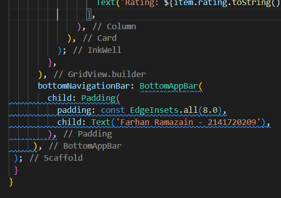
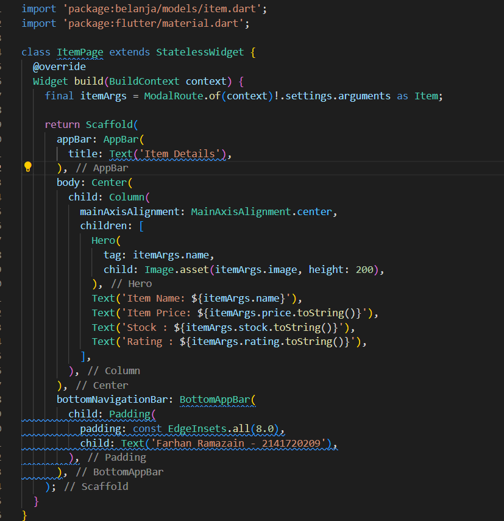
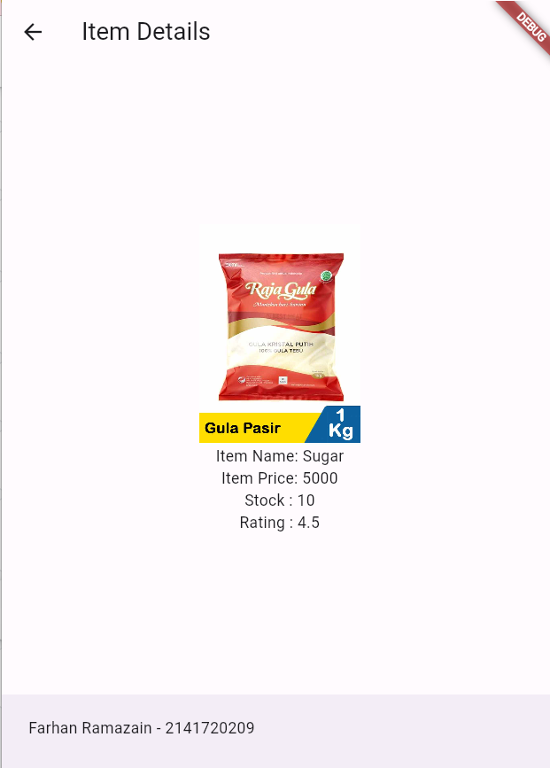

# NAMA : FARHAN RAMAZAIN
# KELAS : TI-3G
# NIM : 2141720209
## UTS

# PRAKTIKUM 5

## Langkah 1

## Langkah 2

## Langkah 3

## Langkah 4

## Output

# Tugas Praktikum 2

## Langkah 1

## Langkah 2

## Langkah 3

## Langkah 4

## Output

